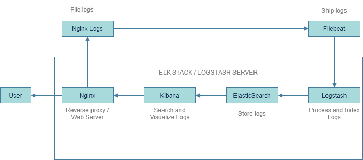

Solution
=========


Technology stack
=========
* [&#10004;] **OCI** [(Oracle Cloud Free Tier)](https://www.oracle.com/cloud/)
* [&#10004;] **Teraform** with [OCI provider](https://registry.terraform.io/providers/hashicorp/oci/latest/docs)
* [&#10004;] **Ansible** [(Ansible Documentation)](https://docs.ansible.com/ansible/latest/index.html)
* [&#10004;] **Docker Engine** [(Docker Engine overview)](https://docs.docker.com/engine/)
* [&#10004;] **Docker Compose** [(Guidelines)](https://docs.docker.com/compose/compose-file/)
* [&#10004;] **Nginx** [(Web and reverse proxy server)](https://www.nginx.com/resources/wiki/start/topics/tutorials/install/)
* [&#10004;] **ELK Stack** [(What is the ELK Stack)](https://www.elastic.co/what-is/elk-stack/)

* [&#10004;] **OS Linux** [(Ubuntu-20.04-minimal)](https://docs.oracle.com/en-us/iaas/images/ubuntu-2004/)


Variables
=========

Most types of Oracle Cloud Infrastructure resources have an Oracle-assigned unique ID called an Oracle Cloud Identifier (OCID). It's included as part of the resource's information in both the Console and API.

Check the documentation to see how can you extract this values from your account: https://docs.cloud.oracle.com/en-us/iaas/Content/General/Concepts/identifiers.htm


### [terraform.tfvars](terraform.tfvars)
---

<code>tenancy_ocid = ""</code>
\
<code>compartment_ocid = ""</code>


And for authentication objects: https://docs.cloud.oracle.com/en-us/iaas/Content/API/Concepts/apisigningkey.htm

<code>private_key_path = ""</code>

<code>user_ocid = ""</code>

<code>fingerprint = ""</code>

Execution
=========

1.- ```terraform init```

2.- Take [terraform.tfvars](/terraform.tfvars) file in the repo and fill it with your own data

3.- ```terraform plan```

4.- ```terraform apply```

5.- ```ansible-playbook -i inventory install-docker.yml```

6.- OPTIONAL to install  with portainer, execute:

```
ansible-playbook -i inventory install-docker.yml -e install_portainer=true
```

Troubleshooting
=========
### terraform:
```TF_LOG=DEBUG terraform apply  ```

#### ssh:
```ssh -i  oci-instances-ssh-key.pem ubuntu@<your-public-ip>```

#### Ansible:
```ansible-playbook -v -i inventory install-docker.yml```
